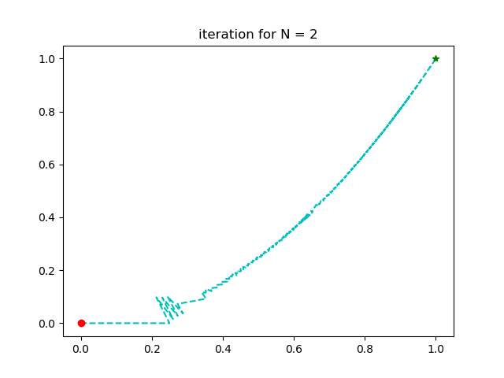

# Numerical Optmization for Robotics
## Homework1 
Linear-search Steepest Gradient Descent on Rosenbrock Function

- Armijo condition
$$
\tau=\{\alpha|f(x_n) - f(x_n + \alpha d) \geq -c \cdot \alpha d^T \nabla f(x_n) \}
                                                    $$

